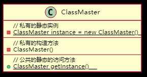

# 设计模式（Design Pattern）
学习设计模式有助于提升代码质量（重用代码，易阅读，易维护，可靠性，扩展性等方面）。  
### 单例模式
**适用范围：** 唯一现象。即一个类只有一个实例对象  
**核心方法：** 将构造函数设置为**私有（private）**  

例如：一个班级只能有一个班主任。

```
public class ClassMaster {
  private String id;
  // 班主任名称
  private String name;
  private String gender;

  // 私有的静态实例
  private static ClassMaster instance = new ClassMaster();

  //私有的构造方法
  private ClassMaster() {
  }

  // 公共的静态访问方法
  //外部类可以通过这个方法访问唯一的实例
  public static ClassMaster getInstance() {
    return instance;
  }
}
```
### Spring中的单例

