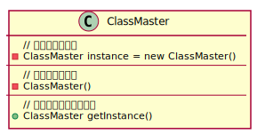
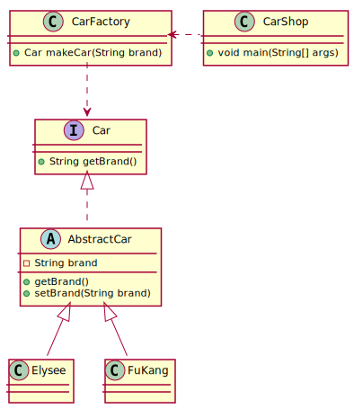
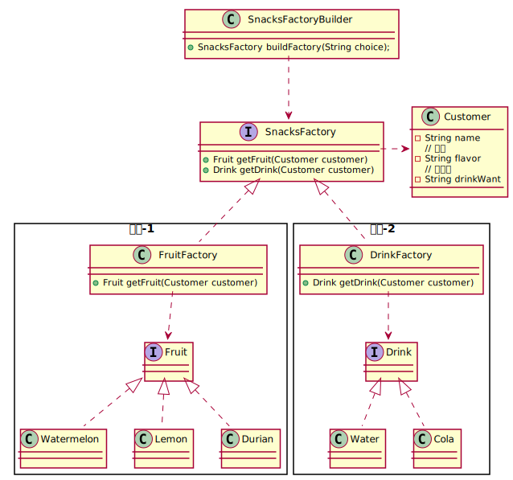

# 设计模式（Design Pattern）
学习设计模式有助于提升代码质量（重用代码，易阅读，易维护，可靠性，扩展性等方面）。  
### 单例模式
**适用范围：** 唯一现象。即一个类只有一个实例对象  
**核心方法：** 将构造函数设置为**私有（private）**  

例如：一个班级只能有一个班主任。

```
public class ClassMaster {
  private String id;
  // 班主任名称
  private String name;
  private String gender;

  // 私有的静态实例
  private static ClassMaster instance = new ClassMaster();

  //私有的构造方法
  private ClassMaster() {
  }

  // 公共的静态访问方法
  //外部类可以通过这个方法访问唯一的实例
  public static ClassMaster getInstance() {
    return instance;
  }
}
```
### Spring中的单例
类变量使用`@Autowired`注解，自动注入对象  
任何自动注入的实例对象，都默认只有一个实例对象，是单例的  
例如：可能多个`Service`或`Control`等都需要用到用户服务，那么这些类中都会定义  
```
@Autowired
private UsersService usersService;
```
>*Spring会保证只生成一个`UserServiceImpl`实例，注入到多个`Service`或`Control`中，不会为每个`Service`或`Control`分别`new`出多个`UserServiceImpl`实现类的实例*

### 简单工厂模式+抽象工厂模式
#### 简单工厂
简单工厂模式适合创建一种对象，看以下类图  
  
`Elysee`和`FuKang`是两个最基础的产品类，他们继承抽象类`AbstractCar`类，而在`AbstractCar`类中包含着两个基础类的基本属性，这样可以避免重复代码，接着，`AbstractCar`类实现`Car`接口，来获取品牌名，而`CarFactory`类通过`Car`接口来制造汽车，而`CarShop`就通过`CarFactory`来实现制造汽车的功能  
这就是一个简单工厂  
#### 抽象工厂
对于**一批，多种类型**的对象产品，使用抽象工厂来解决。  
简单工厂主要把多个同类产品抽象，使用一个统一的工厂创建；那么抽象工厂就是**把多个工厂也进一步抽象**  
   
工厂接口`SnacksFactory`规定工厂提供什么样的产品，所以包含了所有工厂的方法
```
public interface SnacksFactory {
    // 取得水果
    public Fruit getFruit(Customer customer);
    // 取得饮料
    public Drink getDrink(Customer customer);
}
```
然后水果工厂`FruitFactory()`和饮料工厂`DrinkFactory`实现这个接口就行了。  
水果工厂只生产水果，而不生产饮料，但是因为实现工厂接口后，必须也要实现`getDrink()`方法，这时候直接返回`null`即可；  
同理饮料工厂也是一样。  
```
public class FruitFactory implements SnacksFactory {
    public Fruit getFruit(Customer customer) {
        Fruit fruit = null;
        if ("sweet".equals(customer.getFlavor())) {
            fruit = new Watermelon();
        } else if ("acid".equals(customer.getFlavor())) {
            fruit = new Lemon();
        } else if ("smelly".equals(customer.getFlavor())) {
            fruit = new Durian();
        }

        return fruit;
    }

    public Drink getDrink(Customer customer) {
        return null;
    }
}
```
`SnacksFactoryBuilder`是生产工厂的工厂，工厂用来生产产品实例，`SnacksFactoryBuilder`用来生产工厂实例
```
public class SnacksFactoryBuilder {
    public SnacksFactory buildFactory(String choice) {
        if (choice.equalsIgnoreCase("fruit")) {
            return new FruitFactory();
        } else if (choice.equalsIgnoreCase("drink")) {
            return new DrinkFactory();
        }
        return null;
    }
}
```
### 工厂模式结合Spring
可以为`SnacksFactoryBuilder`加上`@Component`注解，让框架管理实例，简单工厂的工厂类也可以去掉`static`，加上注解。  
相应的，**任何**需要使用工厂的地方，只需要使用`@Autowired`注解让框架自动注入实例就行了。  
```
@Service
public class XxxxxServiceImpl implements XxxxxService {

    @Autowired
    private SnacksFactoryBuilder snacksFactoryBuilder;
}
```