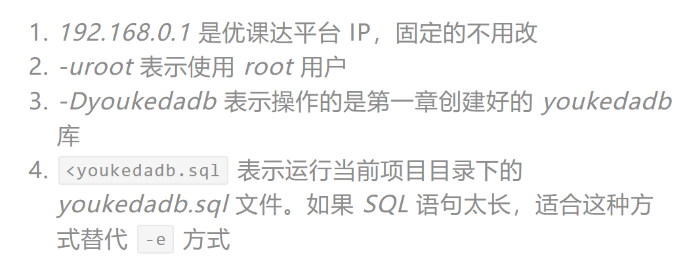

## 优课达SQL操作
### 备份
输入以下备份命令
```
mysqldump -h 192.168.0.1 -uroot youkedadb > youkedadb.sql
```
即可把整个*youkedadb*数据库中的数据导出，然后执行：
```
ls
```
可以看到，除了index.sql文件以外，还多了一个`youkedadb.sql`的备份文件，此时执行Git提交命令，即可推送到优课达GitLab
```
git add .
git commit -am "完成作业"
git push
```
### 恢复数据
打开具有备份文件`youkedadb.sql`的作业，执行以下命令进行恢复数据
```
mysql -h 192.168.0.1 -uroot -Dyoukedadb<youkedadb.sql
```


### 查询表中数据
```
mysql -h 192.168.0.1 -uroot -Dyoukedadb -e 'select * from timi_adc;'
```
```
mysql -h 192.168.0.1 -uroot -Dyoukedadb < index.sql;
```